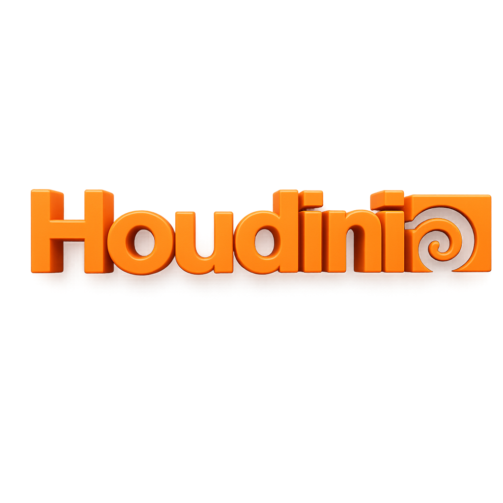

# Houdini Python – Creating Solids via Scripting

Welcome to this educational project that demonstrates how to create basic 3D solids using Python within **Houdini**.

This simple script showcases how you can generate geometrical shapes procedurally, laying the foundation for more complex simulations and models in the future. Whether you're a student of Mechatronic Engineering, a game developer, or a digital artist — this project reveals the power of Python scripting within the Houdini environment.

---

## 🔧 Objective

To illustrate a practical and concise use of Houdini’s Python scripting by generating primitive shapes using the `hou` module. This reinforces not only 3D knowledge but also your multidisciplinary skillset across engineering and game design.

---

## 📜 Features

- 📌 Written entirely in Python for Houdini.
- 📦 Creates several solid objects (box, sphere, tube, torus).
- 🌀 Easy to expand for VFX, procedural animation, or game-ready assets.
- 🧠 Ideal for portfolio projects or GitHub proof of concepts.

---

## 🖥️ Requirements

- Houdini 20+ (Apprentice or Commercial)
- Python 3.x (Built into Houdini)
- Basic familiarity with Houdini interface

---

## ▶️ Quick Preview

Here's what the script generates:

- A cube
- A UV sphere
- A vertical cylinder
- A donut-shaped torus

These are placed in the `/obj` network for easy visualization and experimentation.

---

## 📁 Files

- `create_solids.py`: Python script to generate 3D solids.
- `icon.png`: Custom 3D-style Houdini logo for aesthetic branding.
- `.github/workflows/houdini_script.yml`: GitHub Action to show automation (non-executable placeholder).

---

## 🚀 How to Run the Script

1. Open Houdini.
2. Go to the Python Shell.
3. Copy-paste the contents of `create_solids.py` or run it via Houdini's script editor.
4. Enjoy the auto-generated solids in your OBJ network.

---

## 📚 Learning Focus

This repository is part of a larger journey toward mastering procedural creation using Houdini and integrating 3D workflows into interactive game design (MOBA – *Valhalla Rising*). It reflects a strong commitment to continuous learning and interdisciplinary application.

---

## 🔗 Author

Marcelo S. P. (MSP 2025)  
Creative Developer & Visionary  
🇨🇦 Montréal, QC → New Brunswick, NB  
🌐 [valhallarising.art](https://valhallarising.art)

---

> “Procedural art is the architecture of imagination.”  
> — MSP 2025
