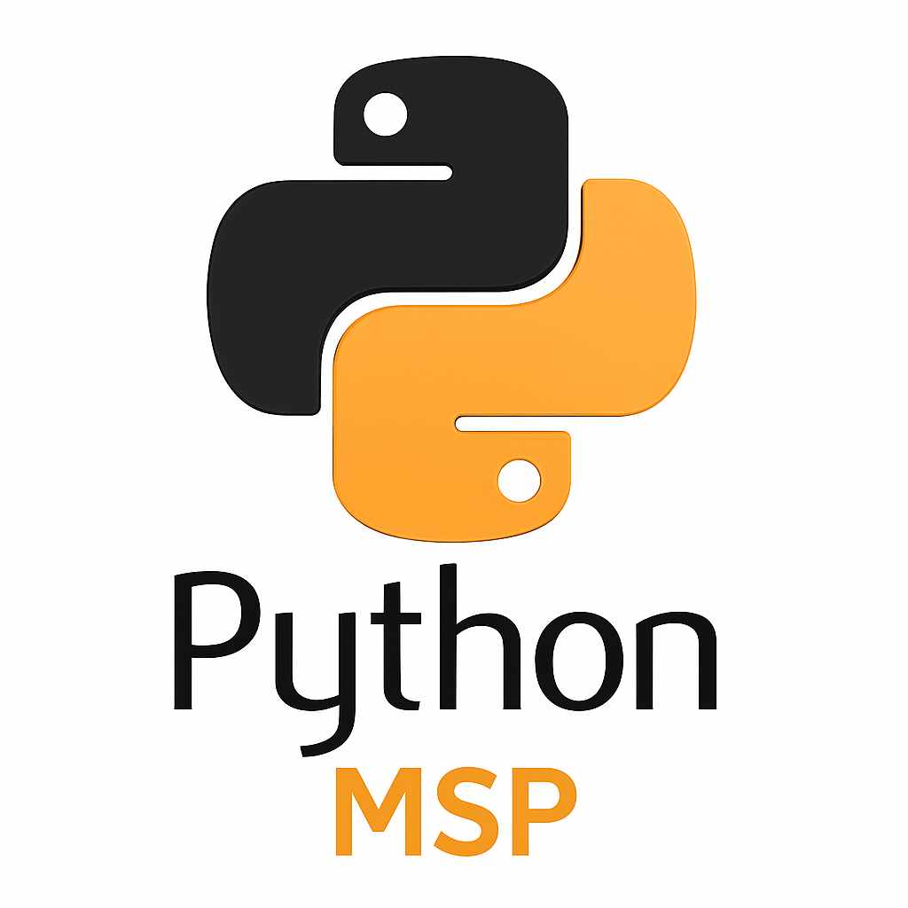

<!-- README.md -->

# 🐍 Python General – Using

> _A multidimensional repository showcasing practical uses of Python in cryptography, neural networks, AI for gaming, and data science._

> _Un dépôt multidimensionnel illustrant l’utilisation pratique de Python en cryptographie, réseaux neuronaux, IA pour le jeu et science des données._

---

---

## 🔐 AES PDF Protection

This module demonstrates how to:
- Encrypt and secure PDF files using AES‑256 encryption
- Generate protected documents programmatically
- Apply password protection and prevent unauthorized access

> Ce module montre comment :
> - Chiffrer et sécuriser des fichiers PDF avec AES‑256  
> - Générer des documents protégés automatiquement  
> - Appliquer des mots de passe et empêcher tout accès non autorisé

📁 Path: `/dev/aes-pdf-protector`

---

## 🧠 NeuroGame AI

An educational sandbox for experimenting with:
- Artificial neural networks (PyTorch, Keras)
- Data preprocessing, normalization and training logic
- Game-like bot behavior, including NPC decision-making
- Modular and scalable AI architecture
- Experimental reinforcement logic (foundation)

> Une base éducative pour expérimenter :
> - Réseaux neuronaux artificiels (PyTorch, Keras)  
> - Prétraitement des données, normalisation, logique d'entraînement  
> - Comportements de bots et prises de décision de PNJ  
> - Architecture d’IA modulaire et évolutive  
> - Logique de renforcement expérimental (fondation)

📁 Path: `/neurogame_ai`

---

## 📦 Included Files and Modules

| File/Folder              | Description (EN‑CA 🇨🇦)                                     | Description (FR‑CA 🇨🇦)                            |
|--------------------------|-------------------------------------------------------------|----------------------------------------------------|
| `main.py`                | Main execution file for AI tasks                           | Fichier principal d'exécution IA                  |
| `neural_network.py`      | Architecture for simple and advanced neural networks        | Architecture de réseaux neuronaux avancés        |
| `utils.py`               | Data normalization and accuracy helpers                     | Outils de normalisation de données et précision   |
| `requirements.txt`       | Dependencies and libraries required                         | Dépendances requises                              |
| `dataset/`               | (Placeholder) training datasets                             | Jeux de données pour l'entraînement               |
| `models/`                | Saved model weights (.pth, .h5, etc.)                       | Modèles sauvegardés                               |

---

## 🧪 Tech Stack & Libraries

- Python 3.11+
- PyTorch
- TensorFlow / Keras
- Scikit-learn
- NumPy / Pandas
- Cryptography
- Matplotlib / Seaborn (optional for visualization)

---

## 🧭 Notes

This repository is part of a long-term portfolio initiative for showcasing practical software engineering and AI logic for educational and professional growth.

> Ce dépôt fait partie d’une initiative de portfolio à long terme, illustrant des applications concrètes en génie logiciel et logique IA à des fins éducatives et professionnelles.

All commits are executed via `git` in the terminal, to reinforce proficiency in version control workflows.

> Tous les commits sont réalisés via `git` dans le terminal, pour renforcer la maîtrise des workflows de contrôle de version.

---

## 👤 Author

**Seth Agnar Kristensen**  
📧 [valhalla.rising.viking@gmail.com](mailto:valhalla.rising.viking@gmail.com)  
🧠 Creative • Analytical • Focused on ethical development

---

🌱 _“Where creativity meets logic, and code becomes a vessel for harmony.”_
